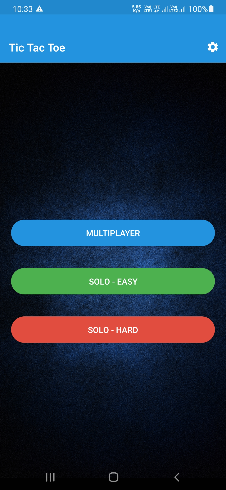
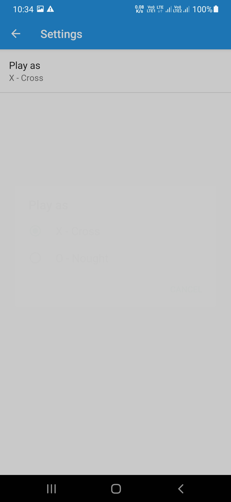
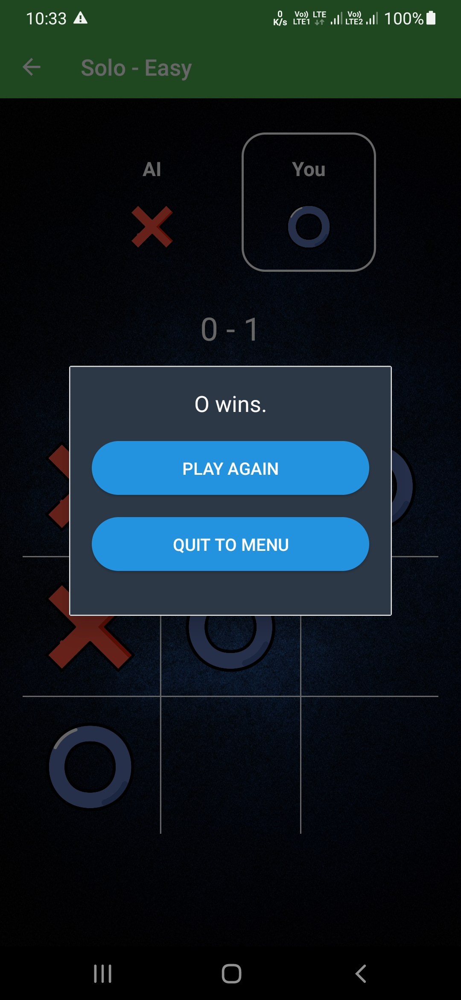
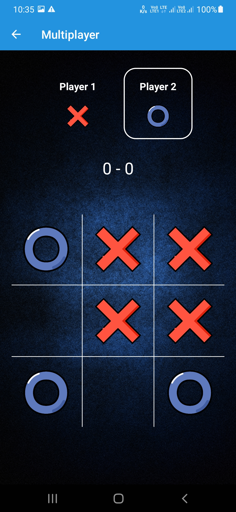
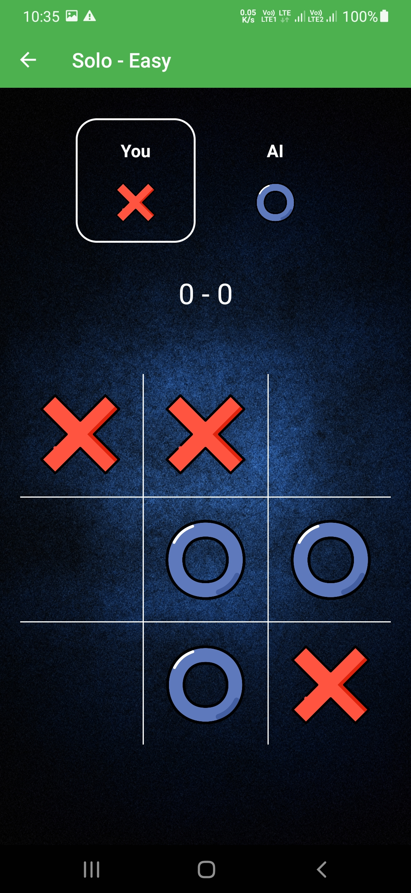
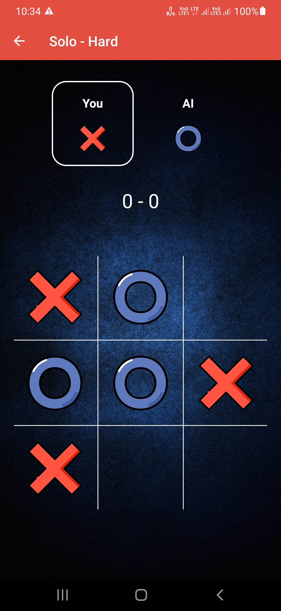
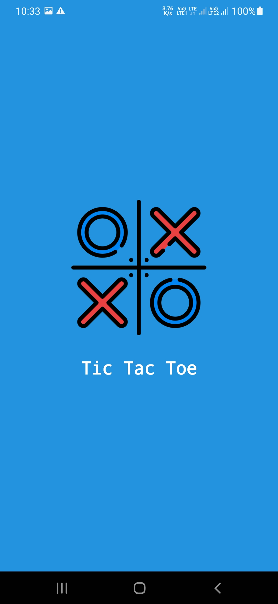

# UltimateTicTacToeApp
<h4>This game consists of 3 modes, Multiplayer, Solo - easy and Solo - hard.
  Multiplayer is to be played between two humans. 
  Solo is to bew played against AI.
  Solo - easy runs a simple function which finds the next move by picking a random box from available boxes.
  Solo - hard runs the minimax AI game playing algorithm.</h4>
  <h4>⚠️It might be impossible to defeat the AI in Solo - hard.</h4>
  
<table style="border-colapse: colapse;">
  <tr>
    <th>Main Menu</th>
    <th>Settings</th>
    <th>Game Over</th>
  </tr>
  <tr>
    <td></td>
    <td></td>
    <td></td>
  </tr>
  <tr>
    <th>Multiplayer</th>
    <th>Solo - Easy</th>
    <th>Solo - Hard</th>
  </tr>
  <tr>
    <td></td>
    <td></td>
    <td></td>
  </tr>
  <tr>
    <th>Splash Screen</th>
  <tr>
  <tr>
    <td></td>
  <tr>
</table>
